# SPA 오픈마켓 서비스

## 1. 목표와 기능

### 1.1 목표

#### 1.1.1 팀 목표

- 싸우지말고 다함께 으쌰으쌰 하여 서로 도와주며 행복하게 프로젝트 마무리하기.

#### 1.1.2 프로젝트 목표

- **바닐라 JS**를 사용하여 판매자와 구매자를 구별하는 **오픈마켓 서비스 개발**.

### 1.2 기능

- 제공된 백엔드 서버 API를 활용한 **SPA(Single Page Application)**오픈마켓 서비스
  - 로그인/로그아웃
  - 회원가입
  - 상품목록
  - 상품상세
- 판매자가 상품을 등록, 판매하며 구매자는 상품을 구매하는 마켓 플랫폼

### 1.3 팀 구성

<table>
	<tr>
		<th>팀장</th>
		<th>팀원</th>
		<th>팀원</th>
		<th>팀원</th>
	</tr>
 	<tr>
		<td>임영후</td>
		<td>허지은</td>
		<td>김규호</td>
		<td>안민</td>
	</tr>
</table>

### 1.4 SPA 도입 배경

본 프로젝트는 **SPA(Single Page Application)** 구조를 채택하였습니다.

SPA 도입 이유는 다음과 같습니다:

- **더 빠른 사용자 경험**  
  페이지 전체를 다시 로딩하지 않고 필요한 부분만 동적으로 렌더링하여,
  더 빠른 화면 전환과 부드러운 사용자 경험을 제공합니다.

- **프론트엔드 중심의 라우팅 처리**  
  서버에서 매번 HTML 파일을 전달받는 전통적인 방식이 아니라,
  `/#경로` 형태의 해시 기반 라우팅을 사용하여 **단일 index.html에서 모든 페이지 전환을 처리**합니다.

- **템플릿, 스크립트 구조의 명확한 분리와 관리**  
  각 페이지별로 템플릿(`templates/*.html`)과 스크립트(`scripts/*.js`)를 나누어 관리하여
  **유지보수와 협업이 용이**합니다.

- **백엔드 의존성 최소화**  
  정적 호스팅 환경(GitHub Pages)에서도 동작 가능하도록, SPA 구조로 구축하여
  **서버 없이도 완전한 프론트엔드 서비스 구현**이 가능합니다.

## 2. 개발 환경 및 배포 URL

### 2.1 개발 환경 및 도구

- JavaScript, TailwindCSS
- Node.js, GitHub Page

### 2.2 배포 URL

- https://netflixu.github.io/openmarket/
- 테스트용 계정
  ```
  - 구매자(buyer)
    - ID : buyer1 PW: weniv1234
    - ID : buyer2 PW: weniv1234
    - ID : buyer3 PW: weniv1234
  - 판매자(seller)
    - ID : seller1 PW : weniv1234
    - ID : seller2 PW : weniv1234
    - ID : seller3 PW : weniv1234
  ```

### 2.3 URL 구조

| App  | URL             | Views Function | Template File Name         | Note          |
| ---- | --------------- | -------------- | -------------------------- | ------------- |
| main | '/'             |                | index.html                 | 홈 화면       |
| main | '/#join'        | join           | templates/join.html        | 회원가입 화면 |
| main | '/#login'       | login          | templates/login.html       | 로그인 화면   |
| main | '/#productList' | productList    | templates/productList.html | 상품목록 화면 |
| main | '/#product'     | product        | templates/product.html     | 상품상세 화면 |
| main | '/#404'         | 404            | templates/404.html         | 404 화면      |

### 2.4 네이밍 컨벤션

| 분류         | 규칙                   | 예시                                |
| ------------ | ---------------------- | ----------------------------------- |
| CSS 클래스명 | kebab-case             | .product-item, .gnb-button          |
| CSS 아이디명 | camelCase              | #productList, #loginForm            |
| JS 변수명    | camelCase              | productList, isLoggedIn             |
| JS 함수명    | camelCase              | handleLogin(), fetchProducts()      |
| JS 클래스명  | PascalCase             | UserService, ProductCard            |
| 파일명       | kebab-case, .js 확장자 | login-page.js, cart-page.js, gnb.js |

### 2.5 Git 관리

#### 2.5.1 깃 브랜치 전략

Github flow + develop branch

| Branch Name   | 규칙                                                                                      |
| ------------- | ----------------------------------------------------------------------------------------- |
| main          | **최종 배포 코드**. 개발 완료된 코드만 올라갈 수 있도록 한다. 삭제하지 않는 브랜치.       |
| dev           | 개발 branch로 이 브랜치를 기준으로 각자 작업한 기능을 병합한다. 삭제하지 않는 브랜치.     |
| 기능별 branch | 기능 단위로 만들어지는 branch로 dev 브랜치에서 생성하며, dev 브랜치로 병합한 후 삭제한다. |

#### 2.5.2 커밋 컨벤션

깃모지 없이 깔끔하게 텍스트로만 구성

```bash
git commit -m 'type: 구현내용'
```

| type     | 설명                                                                       |
| -------- | -------------------------------------------------------------------------- |
| feat     | 기능 구현                                                                  |
| fix      | 버그 수정                                                                  |
| docs     | 문서 수정                                                                  |
| style    | 코드 formatting, 세미콜론 추가 등 코드 내용 수정이 아닌 코드 스타일만 수정 |
| refactor | 코드 리팩토링                                                              |
| test     | 테스트 코드 추가, 테스트 코드 리팩토링                                     |
| chore    | 빌드, 패키지 매니저 등 코드 내용 수정이 아닌 그 이외 사항 수정             |

### 2.6 프로젝트 초기화 및 설치

#### 2.6.1 TailwindCSS 설정 방법 (CLI 방식)

1. 프로젝트 초기화 및 설치

```bash
npm install tailwindcss @tailwindcss/cli
```

2. Tailwind input 파일 생성

`./src/input.css`

```css
@import "tailwindcss";
```

3. 빌드 및 watch 명령어 실행 (빌드시 output.css 생성, '--watch' 모드는 실시간 빌드모드)

```bash
npx tailwindcss -i ./src/input.css -o ./src/output.css --watch
```

4. HTML에서 연결

`index.html` 등

```html
<link href="./src/output.css" rel="stylesheet" />
```

---

#### 2.6.2 Prettier 설정 (Tailwind 플러그인 포함)

1. Prettier 플러그인 설치

```bash
npm install -D prettier prettier-plugin-tailwindcss
```

2. 설정 파일 추가

`prettier.config.js`

```js
module.exports = {
  plugins: [require("prettier-plugin-tailwindcss")],
};
```

3. VSCode Prettier 설정 및 사용법

- Extentions에서 Prettier - Code formatter 확장 설치

- 프로젝트 루트에 설정 파일 생성

`.vscode/settings.json`

```json
{
  "editor.defaultFormatter": "esbenp.prettier-vscode",
  "editor.formatOnSave": true,
  "[html]": {
    "editor.defaultFormatter": "esbenp.prettier-vscode"
  },
  "prettier.plugins": ["prettier-plugin-tailwindcss"]
}
```

```
• 저장 시 자동 정렬: Ctrl + S(저장)할 때마다 Tailwind 클래스가 자동 정렬됩니다.
• 명령어로 실행: Cmd/Ctrl + Shift + P → Format Document 입력 후 실행
```

---

#### 2.6.3 .gitignore 설정

`.gitignore`

```
node_modules/
src/output.css
package-lock.json
.DS_Store
```

## 3. 요구사항 명세와 기능 명세

[요구사항 명세 링크](https://paullabworkspace.notion.site/2-231ebf76ee8a810aad87edf6e9ca290a#231ebf76ee8a81ea848ff4ec9d75788b)

### 로그인

빈값·불일치 → 입력 아래 경고, 포커스 이동

경고 표시 중엔 로그인 불가

성공 시 이전 페이지로 이동(리턴 URL)

구매자 탭 선택 시 구매자, 판매자 탭 선택 시 판매자로 로그인

### 회원가입

필수값 + 약관 동의 체크 시만 가입

아이디와 사업자 등록번호는 중복 시 경고 표시

완료 후 로그인 페이지로 이동

구매자 탭에서 가입 시 구매자, 판매자 탬에서 가입 시 판매자로 등록

회원가입 유효성 오류 메시지 참고 ([링크](https://paullabworkspace.notion.site/231ebf76ee8a81668148d00182700338))

### 상품 목록

판매자/상품명/가격 표시

카드 클릭 → 상세 이동

### 상품 상세

productId 로드

수량은 +/− 버튼만 변경, 재고 초과 시 + 비활성 (판매 회원은 구매와 관련된 모든 버튼 비활성화)

옵션 반영 총 가격 표시

동일 상품 중복 추가 방지 - 도전과제

### GNB

비로그인/구매회원: 검색 + 장바구니

비로그인 상태에서 장바구니/바로구매 클릭 → 로그인 모달

판매회원: 마이페이지 + 판매자센터

### 마이페이지 드롭다운

아이콘 클릭 시 메인컬러, 드롭다운 열기/외부 클릭 닫기

항목: 마이페이지(UI만), 로그아웃

### 푸터

시멘틱 태그를 고려하여 시안 구현

## 4. 프로젝트 구조와 개발 일정

### 4.1 프로젝트 구조

```
project
├─ components
│  ├─ footer.html
│  └─ header.html
├─ images/
├─ index.html
├─ package.json
├─ prettier.config.js
├─ README.md
├─ scripts
│  ├─ 404.js
│  ├─ auth.js
│  ├─ footer.js
│  ├─ getUserInfo.js
│  ├─ header.js
│  ├─ initAutoRefresh.js
│  ├─ join.js
│  ├─ login.js
│  ├─ modal.js
│  ├─ product.js
│  ├─ productList.js
│  ├─ returnUrl.js
│  ├─ router.js
│  └─ tokenStore.js
├─ src
│  ├─ input.css
│  └─ output.css
├─ styles
│  └─ style.css
└─ templates
   ├─ 404.html
   ├─ join.html
   ├─ login.html
   ├─ product.html
   └─ productList.html
```

### 4.1 개발 일정(WBS)

```
- 개발기간
    : 2025년 9월 8일 회의
    : 2025년 9월 9일 ~ 15일(주말 제외 5일)
```

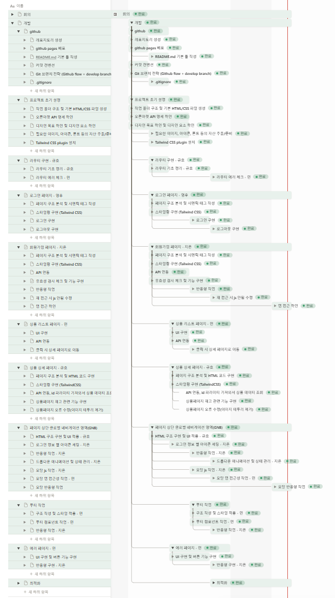

## 5. 역할 분담

- 임영후(팀장)
  - 로그인 페이지
  - 토큰 관리
  - 팀원 업무 및 일정 관리
- 허지은
  - 회원가입 페이지
  - 헤더GNB
  - 전반적인 반응형 작업
  - 노션 관리
- 김규호
  - 상품상세 페이지
  - 프로젝트 초기 설정 (폴더 구조, 깃 설정 등)
  - 라우터 기초 작업
  - 페이지 배포 관리
  - 헤더 컴포넌트 분리 작업
- 안민
  - 상품목록 페이지
  - 404페이지 구현
  - 라우터 에러 체크
  - 푸터 구현 및 컴포넌트 분리 작업

## 6. 와이어프레임 / UI

[피그마 링크](https://www.figma.com/design/rbi8px4O2GrnXN4gK0ZaLv/WENIV_FE_%EC%8B%A4%EC%8A%B5-%EC%98%88%EC%A0%9C?node-id=49-1791&p=f&t=NlVsrGvdZ10glS7b-0)

### 6.1 와이어프레임

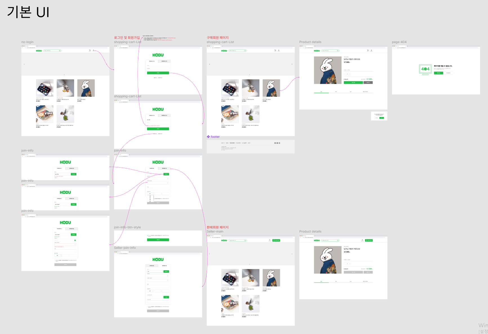

### 6.2 UI

<table>
    <tbody>
        <tr>
            <td>메인(비로그인)</td>
            <td>로그인</td>
        </tr>
        <tr>
            <td>
		
            </td>
            <td>
                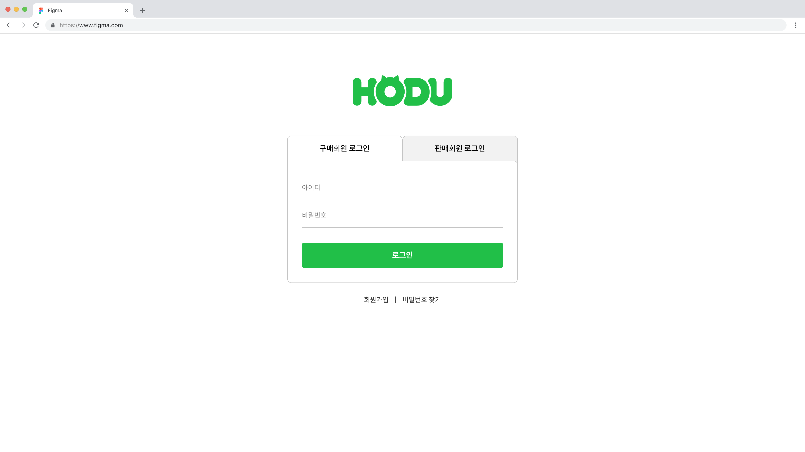
            </td>
        </tr>
        <tr>
            <td>회원가입(구매자)</td>
            <td>회원가입(판매자)</td>
        </tr>
        <tr>
            <td>
                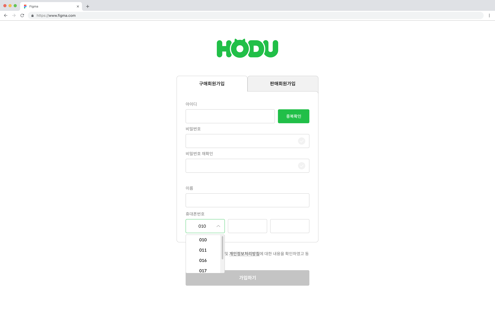
            </td>
            <td>
                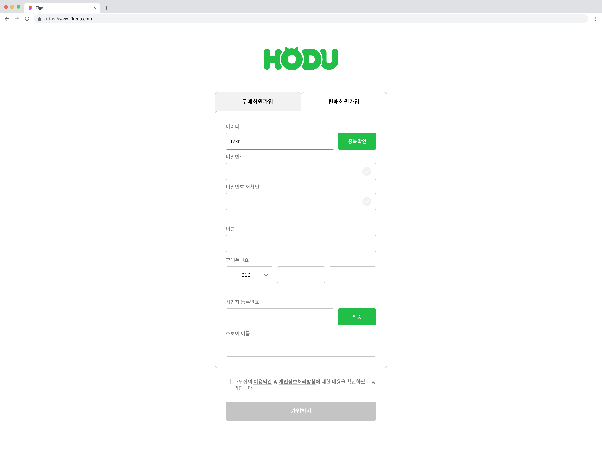
            </td>
        </tr>
        <tr>
            <td>메인(구매자)</td>
            <td>메인(판매자)</td>
        </tr>
        <tr>
            <td>
                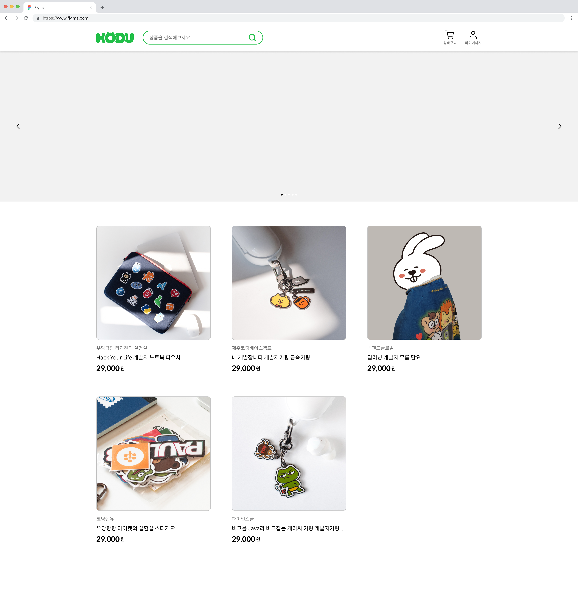
            </td>
            <td>
                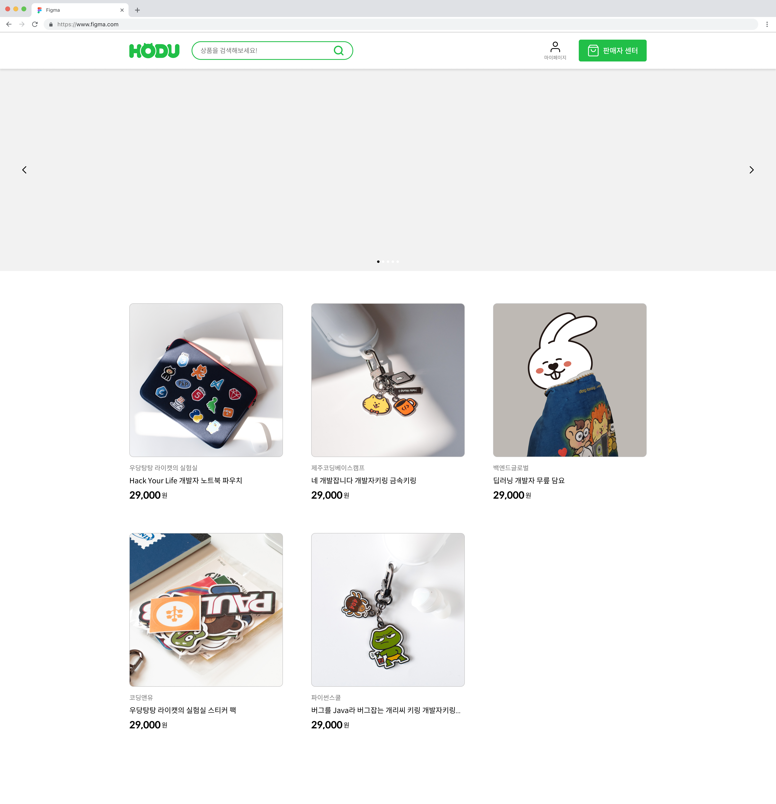
            </td>
        </tr>
        <tr>
            <td>상품 상세(구매자)</td>
            <td>상품 상세(판매자)</td>
        </tr>
        <tr>
            <td>
				        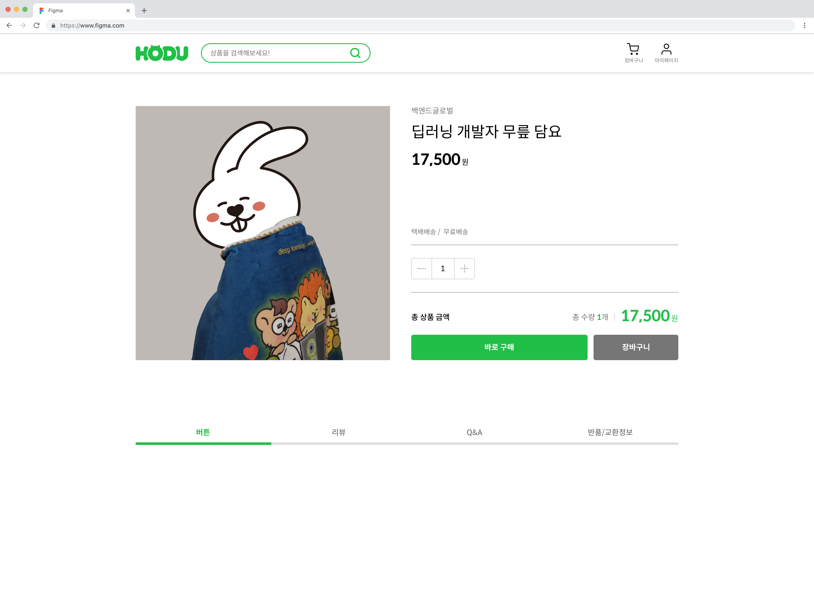
            </td>
            <td>
                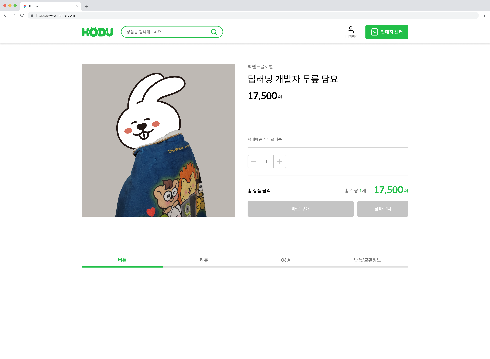
            </td>
        </tr>
        <tr>
            <td>404 에러페이지</td>
            <td>모달 및 드롭다운</td>
        </tr>
        <tr>
            <td>
                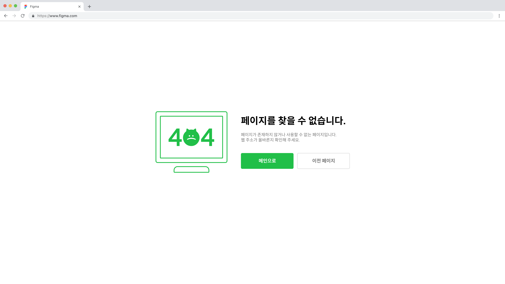
            </td>
            <td>
                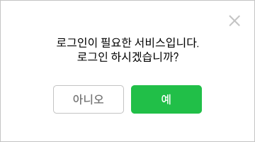
                
            </td>
        </tr>
    </tbody>
</table>

## 7. 메인 기능

- **SPA(라우터)**

- 정규화

- CLI를 이용한 Tailwind CSS 사용

- 회원가입

- 로그인/로그아웃

- 상품목록

- 상품상세(:id)

- GNB 로그인에 따른 상태 관리

## 8. 에러와 에러 해결

- js 먹통사건 : js코드를 함수화 필요할때마다 요청해서 가져오기
- 라우터 갱신 오류 :
- 불라불라
-
- SEO 대응 어려움 :
- 페이지별 메타 태그(og:title, description 등) 처리 한계
- 브라우저 히스토리 관리 복잡

## 9. 개발하며 느낀점

### javascript로 구현한 SPA 도입의 한계

- 초기 로딩 속도 증가
- 모든 기능이 JS에 의존 → 오류 시 전체 페이지 사용 불가

### 팀원 후기

- 임영후 : 서로 으쌰으쌰 하며 프로젝트 마무리를 하는게 목표였는데 잘 마무리 된 것 같아서 만족스럽습니다. 서로의 코드를 리뷰를 진행하면서 서로 모르는 기술적인 부분들을 배우면서 할 수 있는 시간이였습니다.
- 허지은
- 김규호
- 안민
